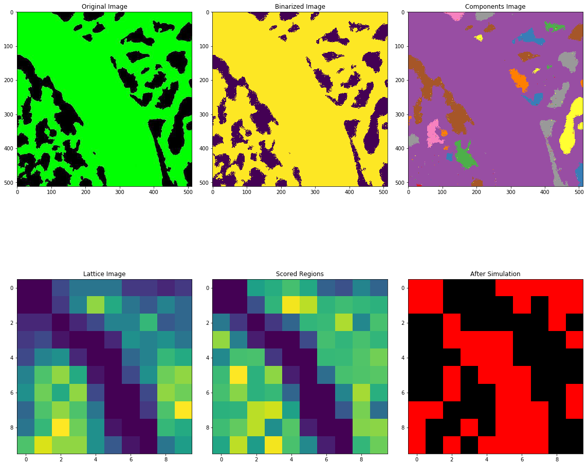

# VSMCs Simulation



In the image above: (top left) the original image; (top middle) the image binarized to {0 1}; (top right) a depiction of the connected components of the image; (bottom left) the lattice image where brightness denotes the number of connected components within range of the cell; (bottom middle) regions scored by the number of components and the brightness of the original image (top left); and (bottom right) the location of all simulated VSMCs.

# Files

```text
├── configuration.py
├── simulate.py
├── images
│   ├── Art-2-vessels-binarized.tif
│   ├── ...
│   └── binary.jpg
├── notes
│   ├── algorithm.jpg
│   ├── ...
│   └── simulation3.jpg
├── vsmcs-simulation-original.ipynb
└── vsmcs-simulation.ipynb
```

The `images` directory will contain images showing veins and capillaries without the VSMCs present.

The `notes` directory contains meeting notes.

The Python files `configuration.py` and `simulate.py` can be used to generate the output panel image (as above) and an animation.

The two notebooks can be used to interactively play with parameters and generate new images and animations.

# Running a Simulation

```bash
# First update configuration.py and then run
./simulate.py
```

This command will generate a directory named `"%Y-%m-%d_%H-%M-%S"` that will include a copy of the configuration file, a panel image, and an animation.

# Notes

- compare with and without repulsion signal
- add caching
